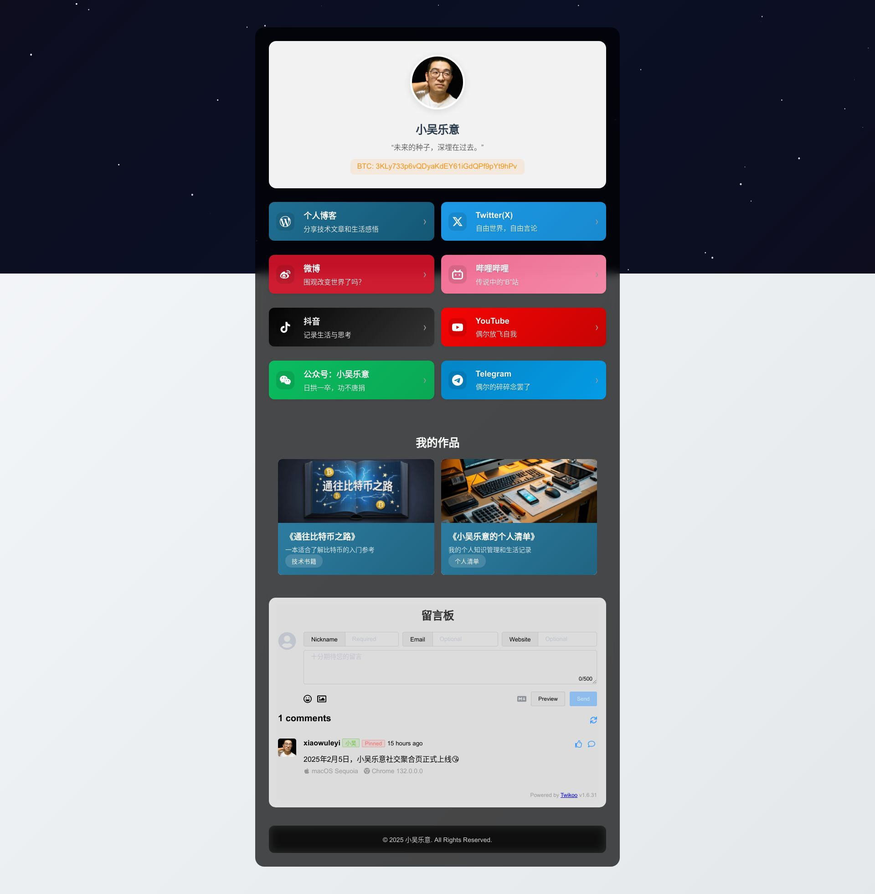

# 个人社交主页

> 本项目由AI生成，仅供测试和学习参考。项目完全开源，可以免费商用，无需特别署名。
> 
> 示例参考网站：[小吴乐意的个人主页](https://www.xiaowuleyi.com)


*上图为示例效果，实际显示效果可能因个人配置和设备而异*

一个优雅的个人社交主页模板，支持展示个人信息、社交媒体链接、作品展示和留言板功能。采用现代化设计，具有流畅的动画效果和响应式布局。

## 功能特点

- 🎨 现代化设计，带有Matrix风格动态背景
- 📱 完全响应式布局，适配各种设备
- 🔗 支持多个社交媒体平台链接
- 💼 作品展示区域
- 💬 集成Twikoo评论系统
- 🌓 优雅的动画和交互效果
- 🔍 内置SEO优化
- 🚀 易于部署和自定义

## 快速开始

1. 克隆或下载此项目到本地
2. 修改 `index.html` 中的个人信息
3. 替换 `image` 文件夹中的图片资源
4. 本地预览或部署到服务器

## 自定义修改指南

### 基本信息配置

打开 `index.html`，你可以修改以下内容：

```html
<!-- 网站标题 -->
<title>你的名字-社交主页</title>

<!-- SEO信息 -->
<meta name="description" content="你的网站描述">
<meta name="keywords" content="关键词1,关键词2">

<!-- 个人信息 -->
<h1>你的名字</h1>
<p class="bio">你的个性签名</p>
```

### 社交媒体链接

在 `index.html` 中的 `.social-links` 部分修改或添加社交媒体链接：

```html
<a href="你的链接" class="social-item 平台名称" target="_blank">
    <div class="icon"><!-- SVG图标 --></div>
    <div class="text">
        <h3>平台名称</h3>
        <p>描述文字</p>
    </div>
    <div class="arrow">›</div>
</a>
```

### 作品展示

在 `.project-grid` 部分添加你的作品：

```html
<a href="作品链接" class="project-item" target="_blank">
    <div class="project-image">
        
    </div>
    <div class="project-info">
        <h3>作品名称</h3>
        <p>作品描述</p>
        <span class="project-tag">标签</span>
    </div>
</a>
```

### 样式修改

你可以在 `style.css` 中修改颜色、字体等样式：

```css
/* 背景颜色 */
#matrix {
    background: linear-gradient(135deg, #你的颜色1, #你的颜色2, #你的颜色3);
}

/* 主题色调 */
.container {
    background: rgba(0, 0, 0, 0.7);
}
```

## 部署到Cloudflare Pages

### 1. 准备工作

- 注册 [Cloudflare](https://dash.cloudflare.com) 账号
- 准备一个 GitHub 账号
- 将项目代码推送到 GitHub 仓库

### 2. 部署步骤

1. 登录 Cloudflare 控制台
2. 进入 Pages 页面
3. 点击 "创建项目"
4. 选择 "连接到 Git"
5. 选择你的 GitHub 仓库
6. 配置构建设置：
   - 构建命令：留空
   - 构建输出目录：留空
   - 环境变量：无需设置
7. 点击 "保存并部署"

### 3. 绑定自定义域名

1. 在项目的 Pages 设置中点击 "自定义域"
2. 点击 "设置自定义域"
3. 输入你的域名（例如：`social.yourdomain.com`）
4. 按照提示配置 DNS 记录：
   - 添加一个 CNAME 记录
   - 名称：根据你的子域名设置（例如：`social`）
   - 内容：Cloudflare Pages 分配的域名
5. 等待 DNS 生效（通常几分钟到几小时不等）

### 4. 更新网站

- 每次推送代码到 GitHub 仓库，Cloudflare Pages 会自动重新部署
- 可以在 Pages 控制台查看部署状态和历史记录

## 评论系统配置

本项目使用 Twikoo 作为评论系统，需要：

1. 部署 Twikoo 服务
2. 修改 `index.html` 中的 `envId`：

```javascript
twikoo.init({
    envId: '你的Twikoo部署地址',
    el: '#tcomment'
});
```

## 许可证

MIT License

本项目完全开源，您可以自由地使用、修改和分发，包括商业用途。您可以：

- ✅ 自由使用，包括商业用途
- ✅ 自由修改源代码
- ✅ 自由分发原始或修改后的版本
- ✅ 无需署名或说明出处

虽然项目使用MIT协议，但您无需在您的项目中保留版权声明，可以直接使用。

## 支持与反馈

如果你在使用过程中遇到任何问题，欢迎提出 Issue 或通过社交媒体联系我。